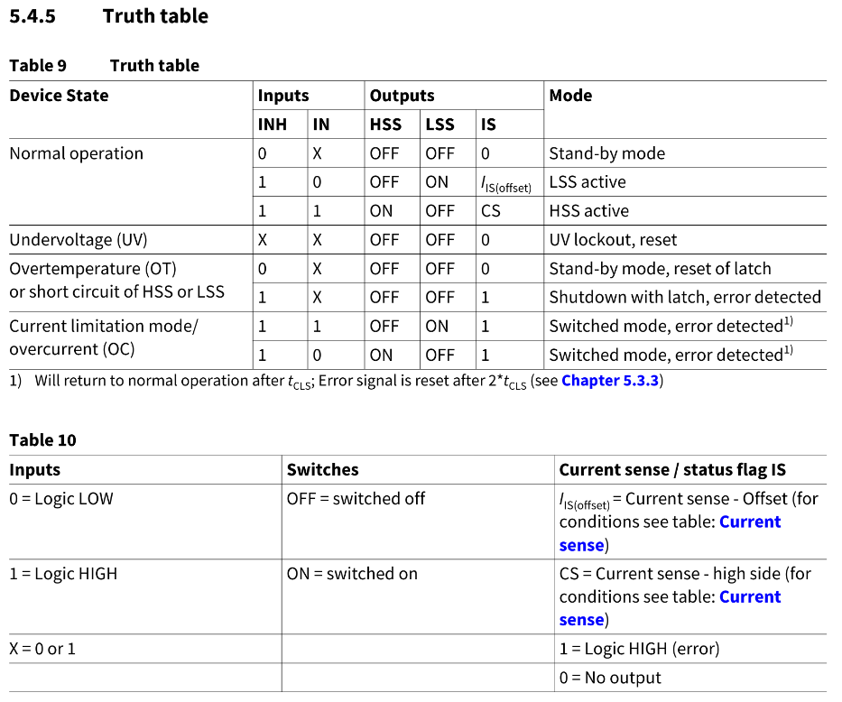
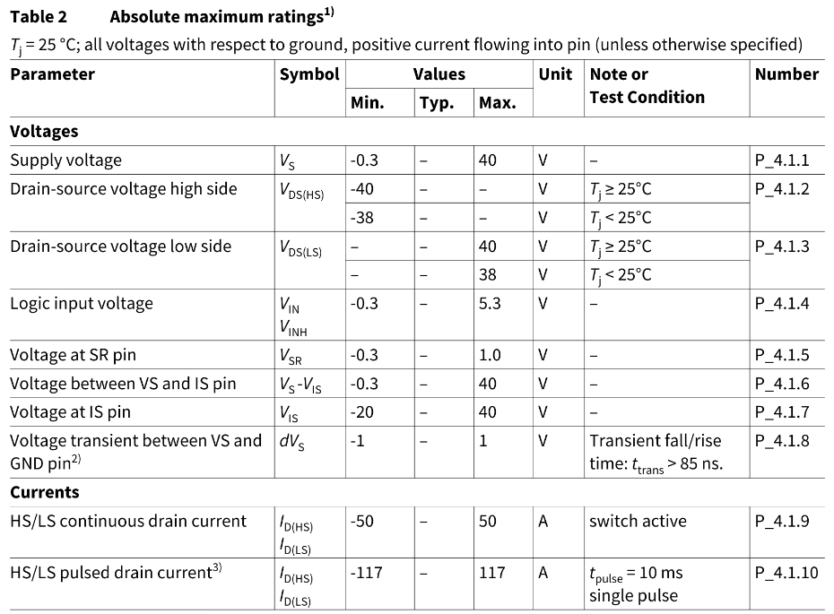

# AMP_PCB_Brake-Controller
PCB with brake motor controller files and documentation

## Features
- Breakout board form factor for easy replacement
- Large maximum current rating (50A continuous, 117A pulse)
- Motor driver (currently) still in production

## Testing
- [X] Order PCB
- [X] Assemble PCB
- [ ] Test PCB
  - [X] Simple forward/reverse polarity
  - [ ] Higher current (motor) load
  - [ ] PWM forward/reverse
  - [ ] PWM motor load

## Notes
- Find reverse polarity protection MOSFET and suitable zener diode
  - MOSFET package: TO-252
  - Zener package: SOT-23
- Use largest 0805 capacitor for C7 (1000uF in schematic)
- To add reverse polarity protection, solder Q1, D1, R1
- To bypass reverse polarity protection, bridge JP1
- All passive components are 0805 package size

---

## Useful figures

Operation truth table:

Absolute maximum ratings:

